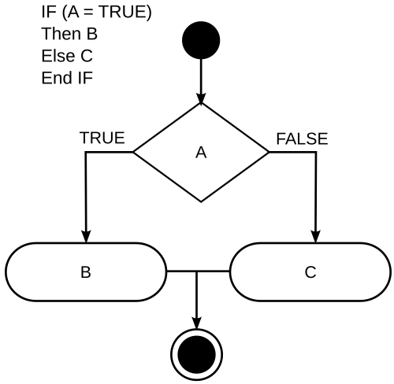

# Exercise: Conditionals

Conditionals are another fundamental topic in programming and the building blocks of algebraic and propositional logic.
Conditional statements are used to perform different actions based on different conditions.

A condition can be either `true` or `false`, and depending on that result it will run a unique execution flow, like in this image:


Go supports the usual comparison operators from mathematics:
Less than `<`
Less than or equal `<=`
Greater than `>`
Greater than or equal `>=`
Equal to `==`
Not equal to `!=`

Additionally, Go supports the usual logical operators:
Logical AND `&&`
Logical OR `||`
Logical NOT `!`

Here is a code example about how conditional works:

```go
var speed=50

// Single condition, nothing happens if it is not satisfied.
if (speed > 60 ){
  fmt.Printf("Only fast animals will see this message")
}
// Output: 

// Single condition, if not satisfied falls into the `else` block.
if (speed < 50){
  fmt.Printf("Going slow")
} else {
  fmt.Printf("You are a fast animal!")
}
// Output: You are a fast animal!

// Multiple conditions
if (speed < 20){
  fmt.Printf("Going slow")
} else if ( speed >= 20 && speed < 30 ) {
  fmt.Printf("You are fast")
} else if ( speed >= 30 && speed < 40 ) {
  fmt.Printf("You are super fast")
} else if ( speed >= 40 && speed <= 80 ) {
  fmt.Printf("You are mega super fast")
} else {
  fmt.Printf("You are the fastest of 'em all!")
}
// Output: You are mega super fast
```

You can use operators or their combinations to create conditions for different decisions, as we've seen with `( speed >= 40 && speed <= 80 )`.
Operators also have precedence, that should be taken into consideration. You can find it in the [go spec](https://go.dev/ref/spec#Operator_precedence), you can modify that precedence by adding parentheses in which operations you want to do together.

```go
42 + 2 * 8  // 42 + (2 * 8) = 58
(42 + 2) * 8 // (42 + 2) * 8 = 352
```

In the code above we changed the priority of the operators by adding parentheses

Exercise:

- Check if the range of a number is between 20 and 30
- If the number is below 20 print : too cold
- If the number is inbetween print: perfect
- If the number is above 30 print : so hot

```go
// Use if and a else if!
package main

import "fmt"

func main () {
  var number int
  fmt.Scanln(&number)

  if (number < 20){
    fmt.Println("Too cold!")
  } else if (number > 20 && number < 30) {
    fmt.Println("perfect")
  } else {
    fmt.Println("so hot!")
  }
}
```

<details>
<summary> Solution: </summary>

```go
package main

import "fmt"

func main () {
  var number int
  fmt.Scanln(&number)

  if (number < 20){
    fmt.Println("Too cold!")
  } else if (number > 20 && number < 30) {
    fmt.Println("perfect")
  } else {
    fmt.Println("so hot!")
  }

}
```

</details>
