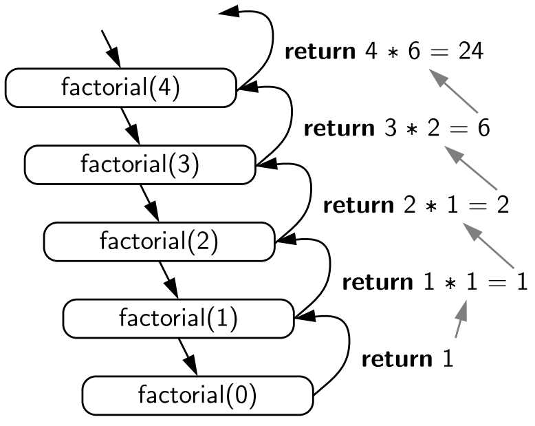

# Exercise: Functions IV

Recursive functions are functions that call themselves.
An example of recursivity are fractals, or the "Linux" word meaning "Linux Is Not UniX".

A recursive function will always find a base case, which is the condition that will stop the function.

The function calls itself, creating a chain of calls. Each call solves a smaller part of the problem. When the base case is reached, the function starts returning the results back up the chain of calls, until the original problem is solved.

To put an example, the factorial of a number, is the number multiplied by n-1 until it reaches the base case, which always is `factorial(0) = 1`

```go
func factorial(n int) int {
  if n == 0 { // base case
    return 1
  } else {
    return n * factorial(n-1) // function calling itself with the argument decreasing.
  }
}
```

As we can see, the function calls itself but with the argument decreasing at every function call. This will drive our function argument closer to the base case after each call. The call stack would look like this:



Exercise:

Create a recursive function that returns the sequence of fibonacci up until the nth number

```go
package main

import "fmt"

// Complete the function signature
func fibonacci() int {
  // Your code goes here

}

func main () {
  // Your code goes here
  
}

```

<details>
<summary> Solution: </summary>

```golang
package main

import "fmt"

func fibonacci(x int) int{
  if (x <= 1) { // base case
    return x
  }
  return fibonacci(x-1) + fibonacci(x-2) // recursive function
}

func main () {
  // Your code goes here
  fmt.Println(fibonacci(9))
}
```

</details>
